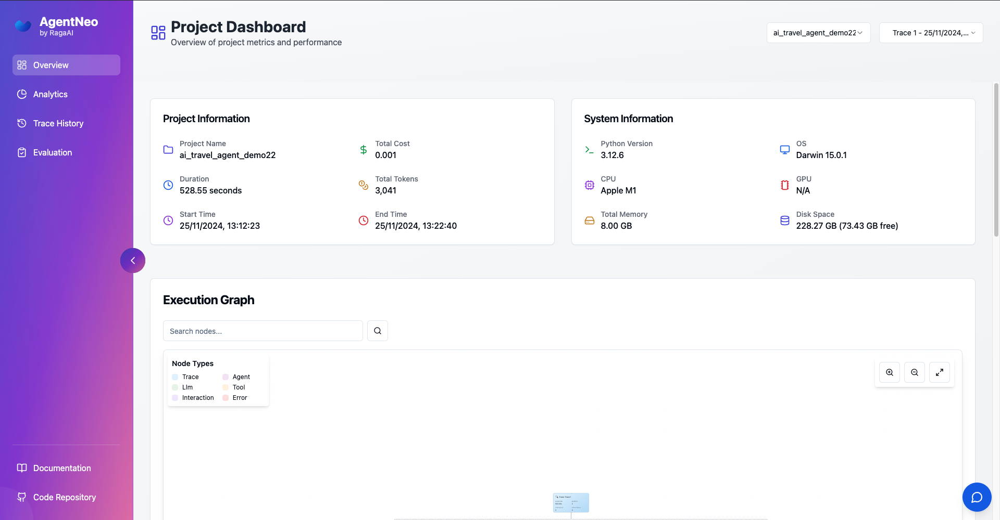
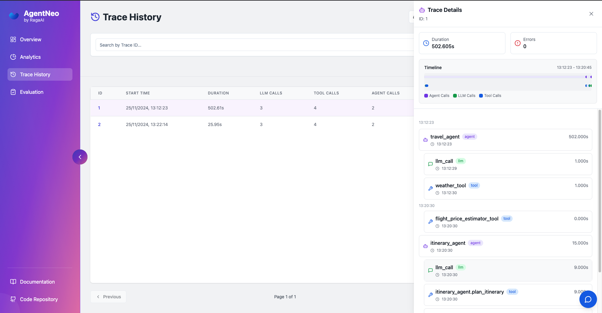

# LLM as a Judge !! 

# AgentNeo
**Empower Your AI Applications with Unparalleled Observability and Optimization**

AgentNeo is an advanced, open-source **Agentic AI Application Observability, Monitoring, and Evaluation Framework**. Designed to elevate your AI development experience, AgentNeo provides deep insights into your AI agents, Large Language Model (LLM) calls, and tool interactions. By leveraging AgentNeo, you can build more efficient, cost-effective, and high-quality AI-driven solutions.


## ⚡ AgentNeo Hackathon

## 🛠 Requirements

- **Python**: Version 3.8 or higher

## 📦 Installation

Install AgentNeo effortlessly using pip:

```bash
pip install agentneo
```



## 🌟 Quick Start Guide

Get up and running with AgentNeo in just a few steps!

### 1. Import the Necessary Components

```python
from agentneo import AgentNeo, Tracer, Evaluation, launch_dashboard
```

### 2. Create a Session and Project

```python
neo_session = AgentNeo(session_name="my_session")
neo_session.create_project(project_name="my_project")
```

### 3. Initialize the Tracer

```python
tracer = Tracer(session=neo_session)
tracer.start()
```

### 4. Instrument Your Code

Wrap your functions with AgentNeo's decorators to start tracing:

```python
@tracer.trace_llm("my_llm_call")
async def my_llm_function():
    # Your LLM call here
    pass

@tracer.trace_tool("my_tool")
def my_tool_function():
    # Your tool logic here
    pass

@tracer.trace_agent("my_agent")
def my_agent_function():
    # Your agent logic here
    pass
```

### 5. Evaluate your AI Agent's performance

```python
exe = Evaluation(session=neo_session, trace_id=tracer.trace_id)

# run a single metric
exe.evaluate(metric_list=['metric_name'])
```

```python
# get your evaluated metrics results
metric_results = exe.get_results()
print(metric_results)
```

### 6. Stop Tracing and Launch the Dashboard

```python
tracer.stop()

launch_dashboard(port=3000)
```

Access the interactive dashboard by visiting `http://localhost:3000` in your web browser.




Thank you for giving this opportunity to be a part of this Hackathon!


