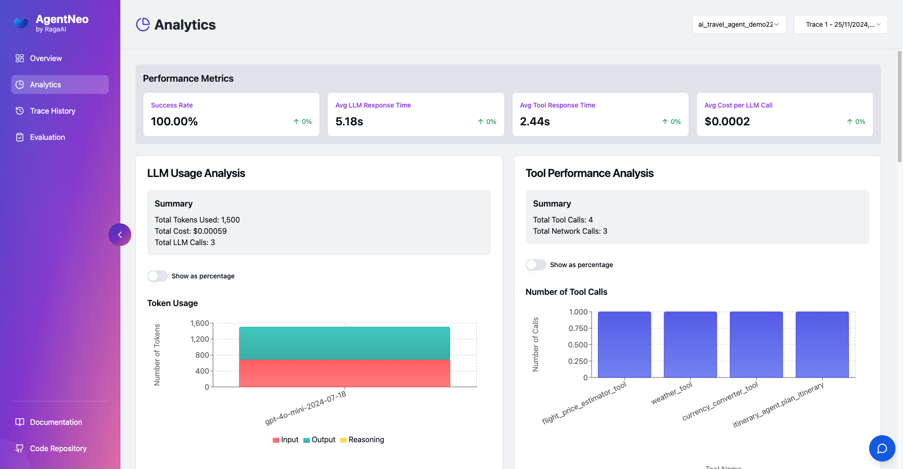

# AgentNeo &nbsp;      


**Empower Your AI Applications with Unparalleled Observability and Optimization**

AgentNeo is an advanced, open-source **Agentic AI Application Observability, Monitoring, and Evaluation Framework**. Designed to elevate your AI development experience, AgentNeo provides deep insights into your AI agents, Large Language Model (LLM) calls, and tool interactions. By leveraging AgentNeo, you can build more efficient, cost-effective, and high-quality AI-driven solutions.


## ⚡ Why AgentNeo?

Whether you're a seasoned AI developer or just starting out, AgentNeo offers robust logging, visualization, and evaluation capabilities to help you debug and optimize your applications with ease.

## 🚀 Key Features

- **Trace LLM Calls**: Monitor and analyze LLM calls from various providers like OpenAI and LiteLLM.
- **Trace Agents and Tools**: Instrument and monitor your agents and tools to gain deeper insights into their behavior.
- **Monitor Interactions**: Keep track of tool and agent interactions to understand system behavior.
- **Detailed Metrics**: Collect comprehensive metrics on token usage, costs, and execution time.
- **Flexible Data Storage**: Store trace data in SQLite databases and JSON log files for easy access and analysis.
- **Simple Instrumentation**: Utilize easy-to-use decorators to instrument your code without hassle.
- **Interactive Dashboard**: Visualize trace data and execution graphs in a user-friendly dashboard.
- **Project Management**: Manage multiple projects seamlessly within the framework.
- **Execution Graph Visualization**: Gain insights into your application's flow with detailed execution graphs.
- **Evaluation Tools**: Assess and improve your AI agent's performance with built-in evaluation tools.

## 🛠 Requirements

- **Python**: Version 3.8 or higher

## 📦 Installation

Install AgentNeo effortlessly using pip:

```bash
pip install agentneo
```


## 🌟 Quick Start Guide

Get up and running with AgentNeo in just a few steps!

### 1. Import the Necessary Components

```python
from agentneo import AgentNeo, Tracer, Evaluation, launch_dashboard
```

### 2. Create a Session and Project

```python
neo_session = AgentNeo(session_name="my_session")
neo_session.create_project(project_name="my_project")
```

### 3. Initialize the Tracer

```python
tracer = Tracer(session=neo_session)
tracer.start()
```

### 4. Instrument Your Code

Wrap your functions with AgentNeo's decorators to start tracing:

```python
@tracer.trace_llm("my_llm_call")
async def my_llm_function():
    # Your LLM call here
    pass

@tracer.trace_tool("my_tool")
def my_tool_function():
    # Your tool logic here
    pass

@tracer.trace_agent("my_agent")
def my_agent_function():
    # Your agent logic here
    pass
```

### 5. Evaluate your AI Agent's performance

```python
exe = Evaluation(session=neo_session, trace_id=tracer.trace_id)

# run a single metric
exe.evaluate(metric_list=['metric_name'])
```

```python
# get your evaluated metrics results
metric_results = exe.get_results()
print(metric_results)
```

### 6. Stop Tracing and Launch the Dashboard

```python
tracer.stop()

launch_dashboard(port=3000)
```

Access the interactive dashboard by visiting `http://localhost:3000` in your web browser.


## 🔧 Advanced Usage

### Project Management

Manage multiple projects with ease.

- **List All Projects**

  ```python
  projects = neo_session.list_projects()
  ```

- **Connect to an Existing Project**

  ```python
  neo_session.connect_project(project_name="existing_project")
  ```

### Metrics Evaluation
#### Supported Metrics
1. Goal Decomposition Efficiency ([goal_decomposition_efficiency](https://docs.raga.ai/agentneo/metric-library/goal-decomposition-efficiency))
2. Goal Fulfillment Rate (goal_fulfillment_rate)
3. Tool Call Correctness Rate (tool_call_correctness_rate)
4. Tool Call Success Rate (tool_call_success_rate)

- **Run multiple metrics together**
```python
exe.evaluate(metric_list=['metric_name1', 'metric_name2', ..])
```

- **Use your own config and metadata related to the metric**
```python
exe.evaluate(metric_list=['metric_name'], config={}, metadata={})

## sample config and metadata
# config = {"model": "gpt-4o-mini"}
# metadata = {
#     "tools": [
#       {
#         "name": "flight_price_estimator_tool",
#         "description": "flight_price_estimator_tool"
#       },
#       {
#         "name": "currency_converter_tool",
#         "description": "currency_converter_tool"
#       },
#     ]
#   }
```


### Execution Graph Visualization

AgentNeo generates an execution graph that visualizes the flow of your AI application, including LLM calls, tool usage, and agent interactions. Explore this graph in the interactive dashboard to gain deeper insights.

## 📊 Dashboard Overview

The AgentNeo dashboard offers a comprehensive view of your AI application's performance:

- **Project Overview**
- **System Information**
- **LLM Call Statistics**
- **Tool and Agent Interaction Metrics**
- **Execution Graph Visualization**
- **Timeline of Events**





### Launching the Dashboard

```python
neo_session.launch_dashboard(port=3000)
```

## 🛣️ Roadmap

We are committed to continuously improving AgentNeo. Here's a glimpse of what's on the horizon:

| Feature                                   | Status          |
|-------------------------------------------|-----------------|
| **Local Data Storage Improvements**       | ✅ Completed    |
| **Support for Additional LLMs**           | ✅ Completed    |
| **Integration with AutoGen**              |  ✅ Completed   |
| **Integration with CrewAI**               | ✅ Completed   |
| **Integration with Langraph**             | ✅ Completed |
| **Tracing User Interactions**             | ✅ Completed   |
| **Tracing Network Calls**             | ✅ Completed   |
| **Comprehensive Logging Enhancements**    | ✅ Completed    |
| **Custom Agent Orchestration Support**    | ✅ Completed    |
| **Advanced Error Detection Tools**        | 🔄 In Progress  |
| **Multi-Agent Framework Visualization**   | ✅ Completed    |
| **Performance Bottleneck Identification** | ✅ Completed    |
| **Evaluation Metrics for Agentic Application** | ✅ Completed  |
| **Code Execution Sandbox**                | 🔜 Coming Soon  |
| **Prompt Caching for Latency Reduction**  | 📝 Planned      |
| **Real-Time Guardrails Implementation**   | 📝 Planned      |
| **Open-Source Agentic Apps Integration**  | 📝 Planned      |
| **Security Checks and Jailbreak Detection** | 📝 Planned    |
| **Regression Testing Capabilities**       | 📝 Planned      |
| **Agent Battleground for A/B Testing**    | 📝 Planned      |
| **IDE Plugins Development**               | 📝 Planned      |

### Legend

- ✅ **Completed**
- 🔄 **In Progress**
- 🔜 **Coming Soon**
- 📝 **Planned**


## 📚 Documentation

For more details, explore the full [AgentNeo Documentation](https://docs.raga.ai/agentneo)

## 🤝 Contributing

We warmly welcome contributions from the community! Whether it's reporting bugs, suggesting new features, or improving documentation, your input is invaluable.

- **GitHub Repository**: [raga-ai-hub/agentneo](https://github.com/raga-ai-hub/agentneo)
- **Contribution Guidelines**: Check out our [Contribution Guidelines](https://github.com/raga-ai-hub/AgentNeo/blob/main/CONTRIBUTING.md) on GitHub to get started.

Join us in making AgentNeo even better!


