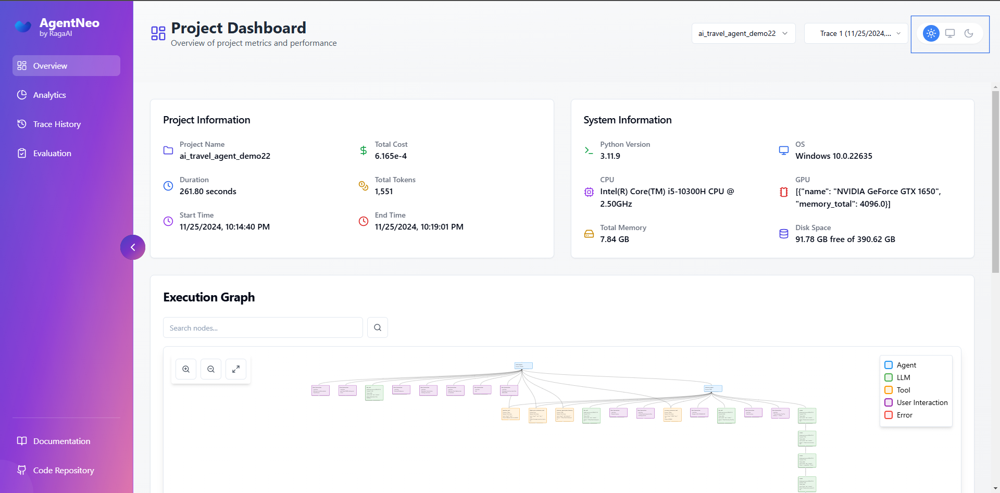

# Main Components

## Tracer

The core component for instrumenting and monitoring code.

### Features

- Function decoration
- Event tracking
- Metric collection
- Data buffering

### Usage

```python
from agentneo import Tracer

tracer = Tracer(session=neo_session)
tracer.start()

@tracer.trace_llm("my_llm")
def llm_function(): pass

@tracer.trace_tool("my_tool")
def tool_function(): pass

tracer.stop()
```

## Dashboard

Interactive web interface for visualization and analysis.

### Features

- Real-time monitoring
- Interactive graphs
- Performance metrics
- Detailed Trace views

### Access

```python
from agentneo import launch_dashboard
launch_dashboard(port=3000)
```

### Theme Change

AgentNeo includes a **Theme Toggle** feature to customize the dashboard's appearance. You can easily switch between **Light**, **Dark**, and **System** themes for a tailored experience.

1. Locate the **Theme Toggle Button** in the **top-right corner** of the dashboard.
2. Choose one of the following options:
   - **Light**: Applies a bright, light-themed interface.
   - **Dark**: Activates a dark, visually comfortable theme.
   - **System**: Automatically syncs with your system's default theme (light or dark mode).

Blue Box on the top right corner:



## Storage

Data persistence layer for traces and metrics.

### Features

- SQLite database
- JSON log files
- Query interface
- Data export

### Configuration

```python
AgentNeo(
    session_name="my_session",
    storage_path="./data",
    storage_type="sqlite"
)
```
