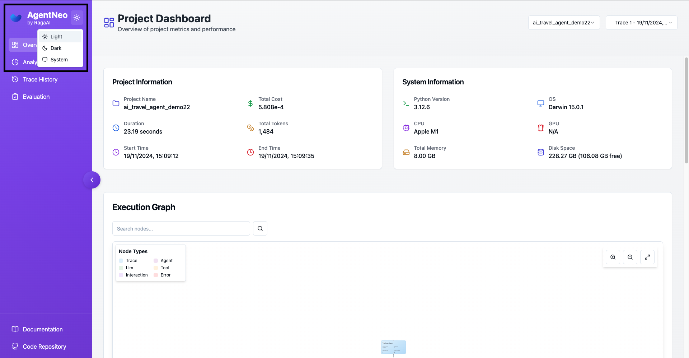

# Main Components

## Tracer
The core component for instrumenting and monitoring code.

### Features
- Function decoration
- Event tracking
- Metric collection
- Data buffering

### Usage
```python
from agentneo import Tracer

tracer = Tracer(session=neo_session)
tracer.start()

@tracer.trace_llm("my_llm")
def llm_function(): pass

@tracer.trace_tool("my_tool")
def tool_function(): pass

tracer.stop()
```

## Dashboard
Interactive web interface for visualization and analysis.

### Features
- Real-time monitoring
- Interactive graphs
- Performance metrics
- Detailed Trace views
- Theme customization - Light/Dark modes (New)

### Access
```python
from agentneo import launch_dashboard
launch_dashboard(port=3000)
```

### Theme Configuration
The dashboard supports both light and dark themes to accommodate different viewing preferences:

- Light Theme: Optimized for daytime viewing.
- Dark Theme: Reduced eye strain in low-light conditions
- System Theme: The default theme that follows the system's theme settings, either light or dark, depending on your device’s configuration.

Theme can be configured through UI 


## Storage
Data persistence layer for traces and metrics.

### Features
- SQLite database
- JSON log files
- Query interface
- Data export

### Configuration
```python
AgentNeo(
    session_name="my_session",
    storage_path="./data",
    storage_type="sqlite"
)
```